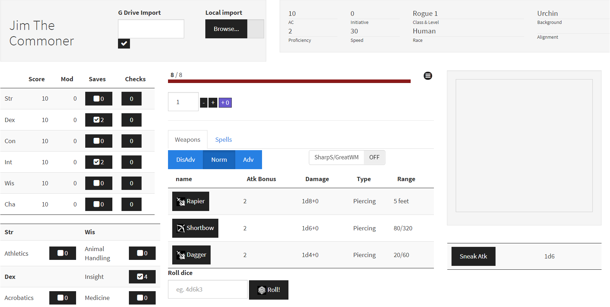
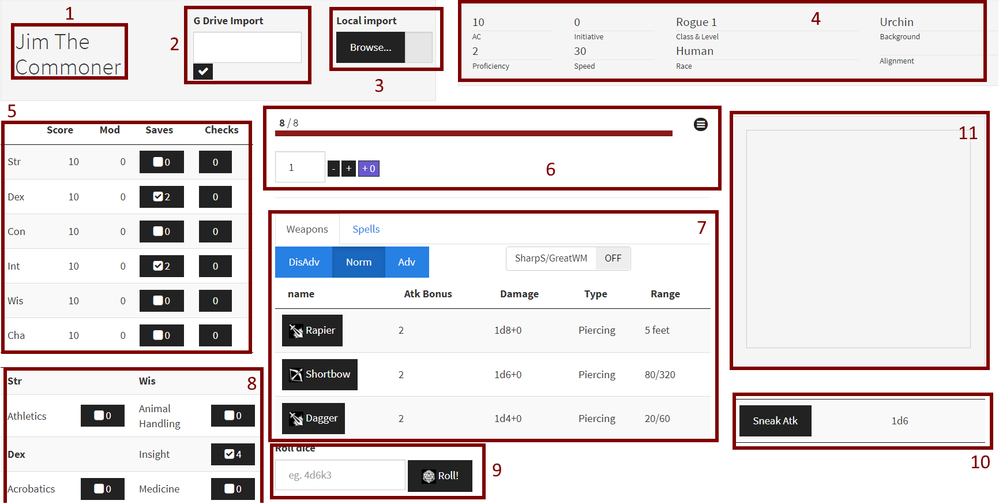

Using the Interactive Sheet
================

This shiny app provides an interactive interface to characters generated by the [Fifth Edition Character Sheet](https://play.google.com/store/apps/details?id=com.wgkammerer.testgui.basiccharactersheet.app&hl=en) app. You either need to download the files and load them or use the name of the file to search if in your google drive (not available to Windows users who used exe installer)

If you are running the sheet through R, use `import5eChar::shinySheet()` or `import5eChar::shinySheetAC()` to run it. Note that `shinySheetAC` function will configure the app to shut down your R session once you close the window.

This is what you'll see when you run the app.

Below is an annotated version. I will be explaining each numbered part seperately

1-Name
------

Who is Jim? He's a nobody, you'll shortly replace this with your own character's name

2-Google drive import
---------------------

This is not available to Windows users who installed it through the exe file. After exporting your character to googlerdive through the app, write a part of the filename that is specific enough to identify your file. Under the hood, this is a regular expression that tries to match your input to the files in your googledrive. So your if your filename is `Tim_Fighter8Cleric1`, you'll be fine if you just write `Tim`. It'll try to load the latest edited file that matches your input, so you don't have to worry about cleaning up your googledrive that often.

Just write text and click the check button. On your first time, you'll be prompted with a authentication. The token is created locally and nothing is sent outside so worry not, I'm not stealing your google accounts.

3-Local file import
-------------------

This option is available to everyone. You need to download your exported character, click here and load it. That's all.

4-Static character information
------------------------------

Nothing interesting here. Just some general info about your character

5-Ability Scores
----------------

This lists your ability scores and saves. You can make checks and saves by clicking the buttons

6-Health
--------

This is your health bar. The menu icon allows you to directly set your max HP current HP and temporary HP. The buttons under the bar allow you to increase or decrease your health by the number on the left. Purple one adds temporary HP. If your health bar is purple instead of red, that means you have temporary HP

Hit dice are not implemented yet

7-Weapons & Spells
------------------

This lists all your weapons and spells (not picured). Clicking the black button rolls attack and damage rolls. Advantage buttons above allow you to set whether or not you have advantage, the `SharS/GWM` weapon toggles the -5/+10 bonus that comes from the relevant feats.

Spells section lists the spells you know, and slots you had on the time of character export. Caster level is one of the few things I haven't figured out how to get sorry. As long as you take a long rest before character export you should be fine.

You can spend or replenish slots by clicking the buttons next to spell levels. Since I don't know your spellcaster level I don't know how many slots you normally have so this currently allows you to increase your slot count to infinity. A fix will come later.

The spells themselves link to dndbeyond spell lists. If you have written the name of the spell correctly, you should be directed to the relevant page. If the conent is paywalled, Dndbeyond will ask you to buy the book instead of showing you the spell info.

The linking behavior can be changed through the `spellSource` variable of the `shinySheet` and `shinySheetAC` functions.

8-Skill checks
--------------

Press button, skill check is rolled.

9-Generic dice
--------------

Roll a dice, any dice. Syntax is similar to roll20 but all rolls need to start with an integer (`d6` bad, `1d6` good). See [here](https://github.com/oganm/diceSyntax/blob/master/README.md) for full details. You are interested in what's written in `roll()` calls in that documentation file.

10-Character resources
----------------------

If your character has access to some resources as codified by the fifth edition char sheet app, you'll see them here. Clicking the button will expand them if they are expandable and roll relevant dice. Expandable resources has a `+` button that allows you to replenish them.

11-Output console
-----------------

This is where you'll see all outputs.
